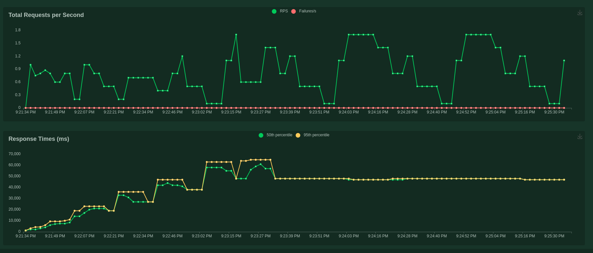
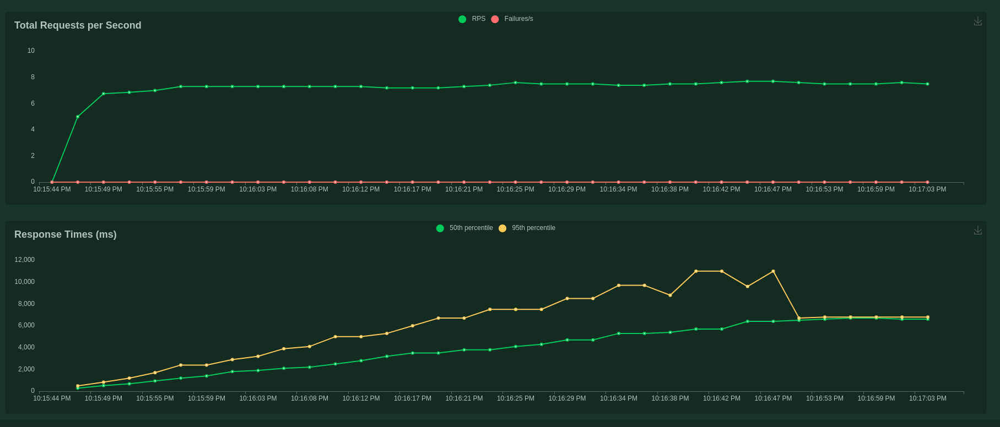

# Load testing analysis <!-- omit in toc -->

# Table of Contents <!-- omit in toc -->
- [Introduction](#introduction)
- [Running tests](#running-tests)
- [Architecture Version 1.0.0](#architecture-version-100)
  - [Architecture Overview](#architecture-overview)
  - [Ingestion API](#ingestion-api)
  - [Serving API](#serving-api)

## Introduction

In order to test if the solution scales, it is interesting to do load testing because it measures
how well the API will handle a large number of concurrent transactions and show potential bottlenecks
for solution architecture.

## Running tests

In order to run the tests you need to install the packages using `pipenv install --dev` in this folder and run `locust`,
this will start the [Locust](https://docs.locust.io/en/stable/index.html) UI and then choose your load on
[`http://localhost:8089`](http://localhost:8089) the Ingestion API is in the following url: `http://localhost:8080`, the Serving API is in the following url: `http://localhost:9000`.

## Architecture Version 1.0.0

### Architecture Overview

The architecture is the following:


We can see that the potential fail points consist mainly on adding and fetching data from Argilla. The assumption is that over a certain load it will not insert any data on Argilla and we will not be able to fetch data using the serving API as well.

### Ingestion API

For the first load testing, we run 50 users at a rate of 1 second each. We have two interesting results:

1) We find an interesting error:

```bash
ERROR:argilla.client.client: client.py:103
Cannot log data in dataset
'toxic_texts'
Error: LiveError
Details: Only one live display may be active at once
```

This error means that we have data that is lost on the upload to argilla. This problem comes up because that by adding the data directly from the Ingestion API we make several POSTs to Argilla asynchronously and Argilla doesn't supports this. We can surpass this problem by delegating the upload to argilla to another part, for instance, the Ingestion API adds data to a database or file storage and then after an amount of time we upload this data to argila in batch format.

2) The plot regarding the load testing is the following:



This figures shows that as the amount of the users grows the response time also grows, this means that we have a bottleneck and our API doesn't scale. One possible solution is the same as the previous case, we can create a database or file storage to keep the data instead of adding directly to argilla and wait for the response.

### Serving API

We have the following plot regarding the load testing the serving API:



One caveat of this test is that we have only ~100 toxic texts and ~100 non toxic texts, as the number of texts grows the query to will take more time.

This figure shows that as we grow the number of users, the response time grows, which makes the application not scale as the Ingestion API. As stated before, the best solution is to serve the data on a database, in this case an analytical database is best suited as it can handle a huge amount of data.
